autoscale: true
theme: Plain Jane,0

# **What is an Algorithm?**

#### Information Analytics
#### Week 7

---

# Is this an Algorithm?

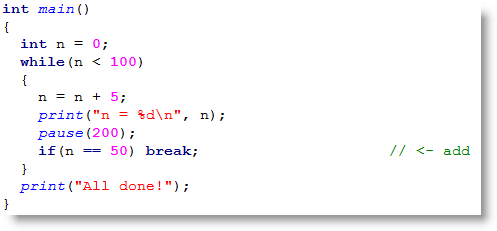

---

# Or this?

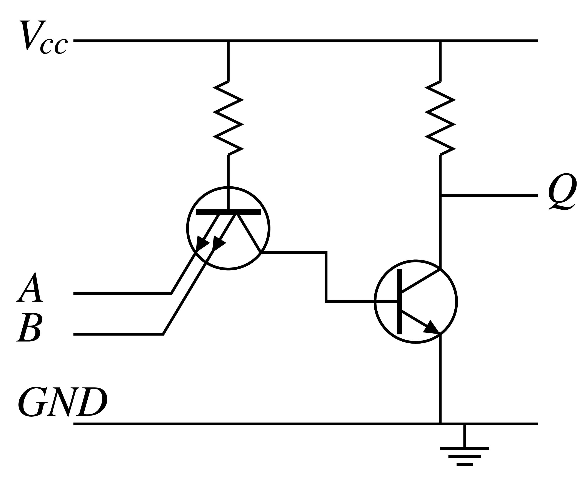

---

# Or this?

---

## Algorithms are very old

Have something to do with this guy

Muḥammad ibn Mūsā al-Khwārizmī  
c. 780 – c. 850

^ A Persian mathematician, astronomer and geographer during the Abbasid Caliphate, and a scholar in the House of Wisdom in Baghdad.

---

## al-Khwārizmī wrote this book

Al-Kitāb al-muḫtaṣar fi ḥisāb  al-ğabr wa-l-muqābala
*On the Calculation with Hindu Numerals*

Better known by its Latin name,   **Algoritmi de numero Indorum**

^ In 825 Al-Khwārizmī wrote a treatise in Arabic, On the Calculation with Hindu Numerals, which survives only as the 12th-century Latin translation, Algoritmi de numero Indorum. Algoritmi, the translator's rendition of the author's name, gave rise to the word algorithm (Latin algorithmus, "calculation method").

---

## **Algorithms are as old as Algebra**

## Also as old as computing

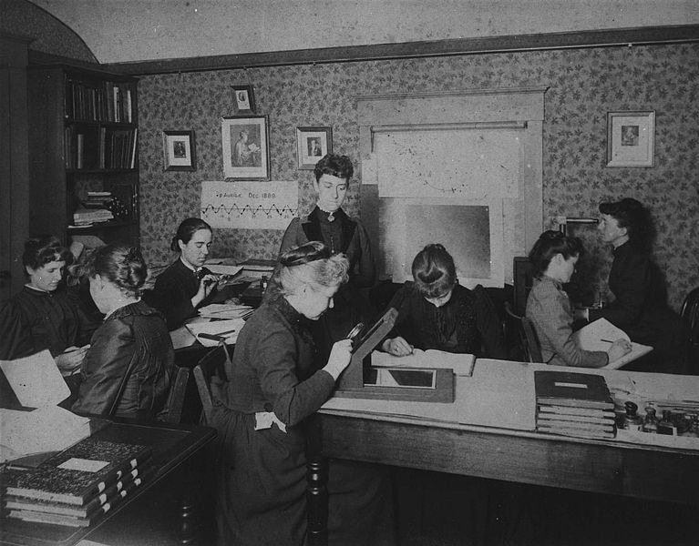

^ The group of women computers at the Harvard College Observatory, who worked for the astronomer Edward Charles Pickering, c. 1890.

---

## **Algorithms are as old as Algebra**

## Also as old as electronic computing

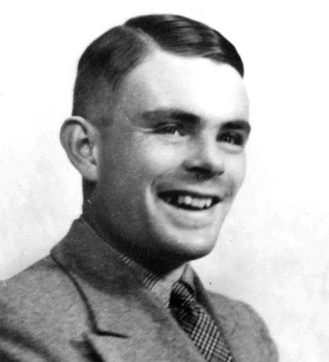 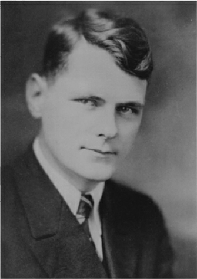 

^ Alan Turing and Alonzo Church

---

# The Universal Turing Machine

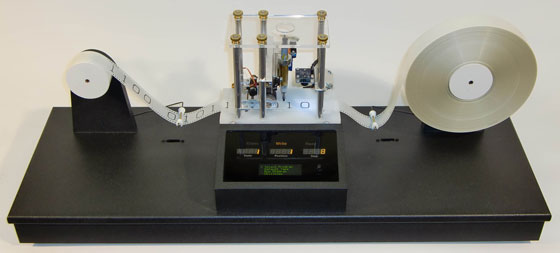

^ 
^ Turing made the point that this machine could solve any mathematical problem that was algorithmic, i.e. that could be solved by computors (the people).

---

# **What is an Algorithm?**

 
An algorithm is an effective method that can be expressed within a finite amount of space and time and in a well­defined formal language for calculating a function. Starting from an initial state and initial input (perhaps empty), the instructions describe a logical process that, when executed, proceeds through a finite number of well­defined successive states, eventually producing "output" and terminating at a final ending state.

---

# **What is an Algorithm?**

 
A self­ contained step by step set of instructions  to be performed, that must end (at some point).

---

# This is an Algorithm

 

---

# And this

---

# An anchient one from Euclid

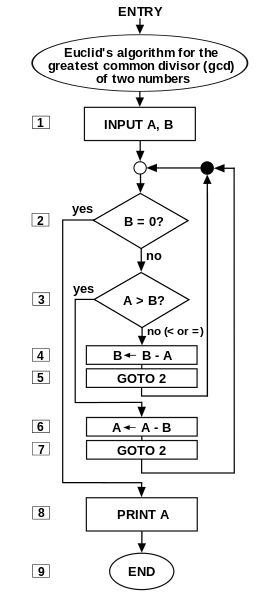

---

# An algorithm solving computer - Analogue

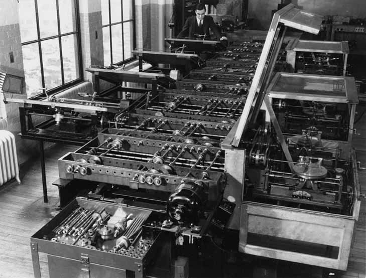

---

# Also, how all digital computers work

---

# This is a bit clearer

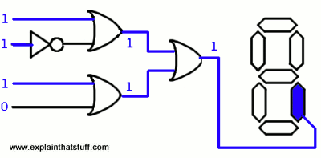

---

# I particularly like this one

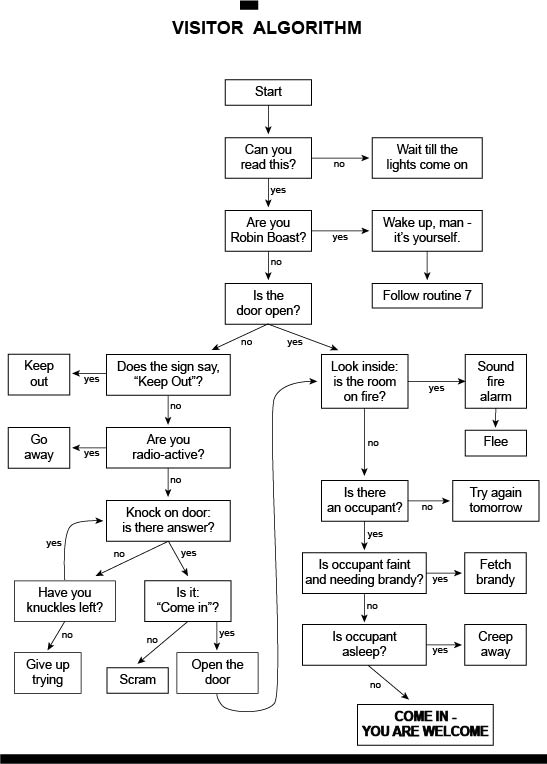

---

# [fit] **BREAK**

---

# What is Computational Logic?

---

# What is Computational Logic?

### Invention of AI
First Computational Logic Lab at Edinburgh University from 1972

Metamathematics Unit at the University of Edinburgh was renamed “The Department of Computational Logic” in the School of Artificial Intelligence.

## **But Just What Is It?**

---

**Computational Logic is a wide interdisciplinary field having its theoretical and practical roots in mathematics, computer science, logic, and artificial intelligence. Its subfields include:**
    - Mathematical logic
    - Logic programming
    - Deduction systems
    - Knowledge representation
    - Artificial intelligence
    - Methods of formal specification and verification
    - Inference techniques
    - Syntax-directed semantics
    - The relationship between theoretical computer science and logic.

---

## Computational Logic is, basically:

 
# **Deduction**

---

## Computational Logic is, basically:

 
# **Deduction**

# **IF A is True and B is True, then (A,B) is True**

## **Formal Logic**

---

# **This is what Formal Logic looks like**

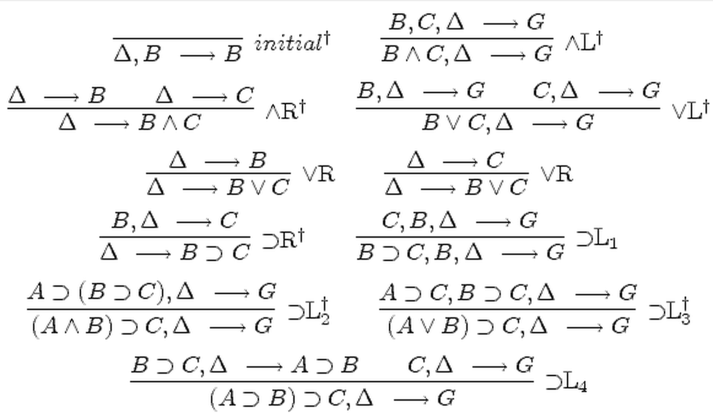

---

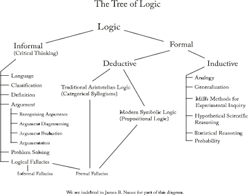

# **It is geneologically organised like this**

---

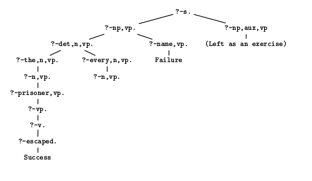

# **You can also do proofs with it like this**

---

# **But, what does this look like?**

---

# **ALOGRITHMS**

^ The two are deeply related because of logic's historical relationship with Algebra.

---

# **Make your own algorithm**

1. Break up into 4 groups
1. In your group, devise an algorithm for the following problem:
    - __How to make a cup of tea?__
    - Make sure to make it detailed, you are telling a machine how to do this
1. Write down your algorithm and present it to the class for 5 minutes

