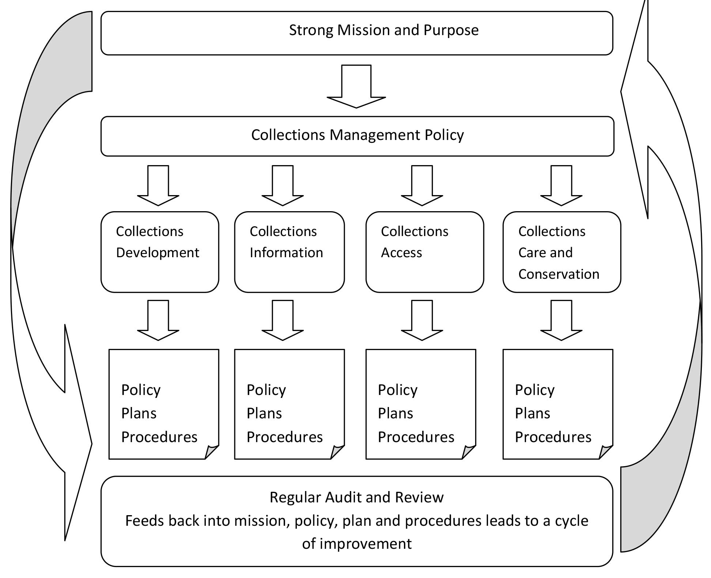
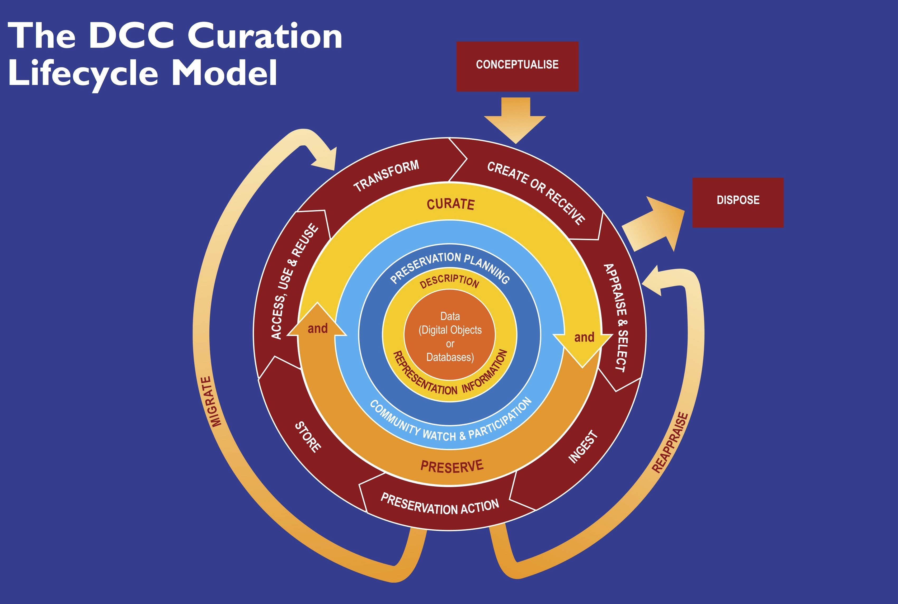
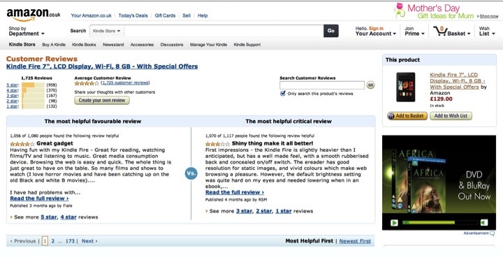

autoscale: true
theme: Plain Jane,0

# INFORMATION ANALYTICS

## Digital Curation
#### Week 2

---

# What is Curation?

**To Care For**

---

### Became a byword for institutional organisation and care

**In Libraries, Archives and Museums**

---

# 19th Century Curation

**From Personal Choice to Institutional Choice**

- Selection
- Order
- Visibility
- Identity

---

# Transformations

### **William Flowers and the London NHM**

---

## Curation Model

---

# Curation Model

- Selection
- Collect
- Document
- Preserve
- Store/Display

---

---

# Preservation

- substance of the object
- identity of the object

---

# Preservation

- substance of the object
- identity of the object
   
- **Use through authenticated descriptions**

---

# What is missing here?

**The British Library from 1880s**

---

# What is missing here?

**Fiona Cameron**

---

## **In the Digital, Things are Different**

Not from the institution to the user,    From the User to the institution.

---

# Is this Curation?

---

# Is this Curation?

---

# Is this Curation?

---

# Is this Curation?

---

# Is this Curation?

---

## **Curated Lists ca 1997**

---

## **[www.reddit.com](https://www.reddit.com/)**

---

## **[www.robingood.com](http://www.robingood.com/)**

---

## **[Activism for the 21st Century](http://21stcenturyactivist.weebly.com/digital-curation.html)**

---

## **Curation in the 21st Century**

Remains Institutional in some places:
    - Traditional curatorial life cycle
    - Authorised and situated
    - Closed resource

Mostly, though, non-institutional:
    - Local, community or even individual
    - Open, reusable, dynamic
    - Multiple

---

## **Curation in the 21st Century**

Remains Institutional in some places:
    - Traditional curatorial life cycle
    - Authorised and situated
    - Closed resource

Mostly, though, non-institutional:
    - Local, community or even individual
    - Open, reusable, dynamic
    - Multiple

**Increasingly, activist.**

---

# **QUESTIONS?**

---

# Doing Something

1. Each of you get online.
1. Find an example of digital curation that is not insitutional.
    - It **CANNOT** be one of the examples I have mentioned.
1. You will present it, informally, to the class in 20 mintues.
