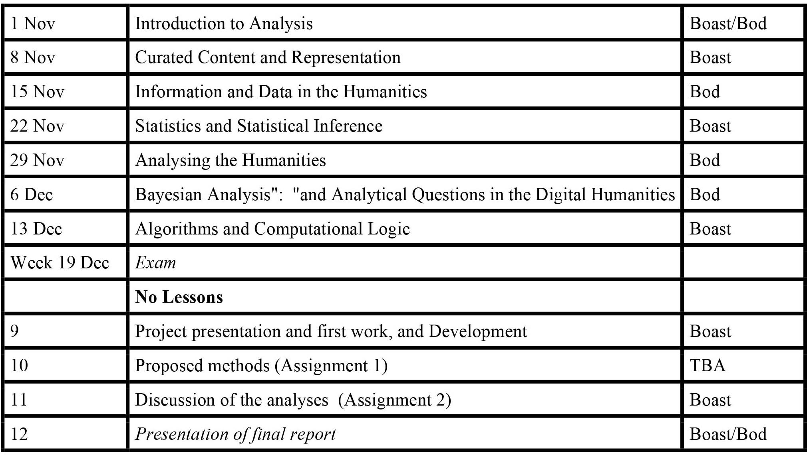

<!DOCTYPE html>
<html>
  <head>
    <title>Title</title>
    <meta charset="utf-8">
    
  </head>
	<body>
	<textarea id="source">
	
class: center, middle

# INFORMATION ANALYTICS

## Introduction to the Course

Week 1

--- <!-- separates slides -->

# Teachers

### Rens Bod

### Robin Boast

#### May be others

---

# Course

### Week to Week

??? <!-- separates notes -->

Discuss the structure of the course

Mention that there will be readings each week. Everyone should come to class prepared to discuss the readings. There will be an introduction to the subject, then a discussion of the key issues, that everyone is expected to participate in.

Labs will be in Block 3

There will also be an assignment each week that will prepare you for the course. These are unmarked but important for you to get the most from the class.

---

# Assessments

### Requirements to complete the course

You pass if you achieve at least a 5.5 on all the assignments, and the exam

### Assessment criteria and assessment form

The multiple choice exam will be assessed on the proportion of correctly marked answers (i.e. 55% of correct answers = 5.5)

The three assignments will cover (1) proposal of methods (pass/fail), (2) discussion of analysis (pass/fail), and (3) presentation of analysis (1-10). The assignments will be presented in class and will be reviewed on the basis of the following criteria:

**Assignment 1:**
* Written proposal of methods for analysis.
	
**Assignment 2:**
* Individual written discussion of analysis.

**Assignment 3:**
* Presentation of Analysis
		Assessment criteria:
		* understanding of the question;
		* completeness;
		* clarity;
		* originality of student's argument.
		* degree that the presentation does, or does not, go beyond the stated goals to challenge current practice;
		* quality of the presentation.

---

# Value of the Assessments

* Multiple Choice Exam  =  40%
* 1st Assignment  =  10%
* 2nd Assignment  =  10%
* Report and Presentation  =  40%

---

# Final Points

This is a graduate course. You are expected to participate and discuss

You will be expected to come prepared having read the material (there is not much) and done the assignment.

Classes will always include some talking (buy us) and some discussion (with all of us).

---

# Questions?

    </textarea>
    
    
  </body>
</html>

<!-- Convert markdown to presentation

    markdown-to-slides /path/to/slideshow.md -o /path/to/slideshow.html

### Document mode

Add the -d flag for document mode

    markdown-to-slides -d /path/to/slideshow.md -o /path/to/slideshow.html -->
    