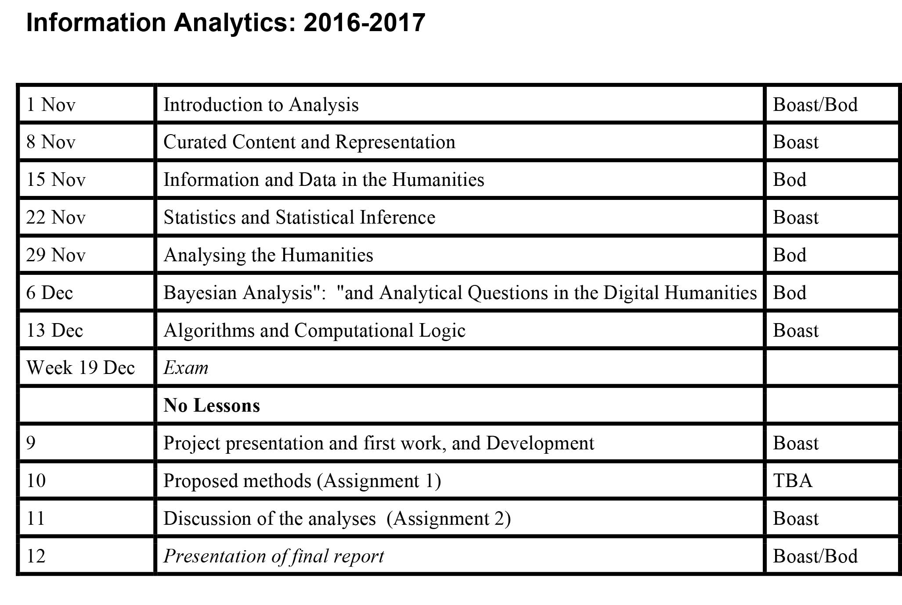

autoscale: true
theme: Plain Jane,0

# INFORMATION ANALYTICS

## Introduction to the Course

####Week 1

---

# Teachers

.

**Rens Bod**

**Robin Boast**

May be others

---

---

# Assessments

.

**Requirements to complete the course**

You pass if you achieve at least a 5.5 on all the assignments, and the exam

---

### Assessment criteria and assessment form

The multiple choice exam will be assessed on the proportion of correctly marked answers (i.e. 55% of correct answers = 5.5)

The three assignments will cover (1) proposal of methods (pass/fail), (2) discussion of analysis (pass/fail), and (3) presentation of analysis (1-10). The assignments will be presented in class and will be reviewed on the basis of the following criteria:

---

**Assignment 1:**

- Written proposal of methods for analysis.
	
**Assignment 2:**

- Individual written discussion of analysis.

**Assignment 3:**

* Presentation of Analysis
Assessment criteria:

    * understanding of the question;
    * completeness;
    * clarity;
    * originality of student's argument.
    * degree that the presentation does, or does not, go beyond the stated goals to challenge current practice;
    * quality of the presentation.

---

# Value of the Assessments

* Multiple Choice Exam  =  40%
* 1st Assignment  =  10%
* 2nd Assignment  =  10%
* Report and Presentation  =  40%

---

# Final Points

This is a graduate course. You are expected to participate and discuss

You will be expected to come prepared having read the material (there is not much) and done the assignment.

Classes will always include some talking (buy us) and some discussion (with all of us).

---

# Questions?

---

# BREAK

---

# GitHuib

## Version Control System

^ Git was created by Linus Torvalds in 2005 for development of the Linux kernel, with other kernel developers contributing to its initial development. Its current maintainer is Junio Hamano.

^ As with most other distributed version control systems, and unlike most client–server systems, every Git directory on every computer is a full-fledged repository with complete history and full version-tracking capabilities, independent of network access or a central server.

^ Like the Linux kernel, Git is free software distributed under the terms of the GNU General Public License version 2.

^ The name "git" was given by Linus Torvalds when he wrote the very first version. He described the tool as "the stupid content tracker" and the name as (depending on your mood)

---

# GitHuib

Characteristics

1. Strong support for non-linear development
    - Git supports rapid branching and merging, and includes specific tools for visualizing and navigating a non-linear development history. 

1. Distributed development
    - Git gives each developer a local copy of the entire development history, and changes are copied from one such repository to another. 

1. Efficient handling of large projects
    - Torvalds has described Git as being very fast and scalable.

1. Fundamental assumption is collaboration and sharing
    - Opensource in principle, and to the core of the system

---

# GitHuib

## https://github.com/

---

[Learning GitHub] (https://guides.github.com/activities/hello-world/) and setting up your first repository
    - https://guides.github.com/activities/hello-world/

[GitHub Pages] (https://pages.github.com/)
    - [Video Tutorial] (https://www.youtube.com/watch?v=FiOgz3nKpgk)

For the ambitious:
[Learning GIT] (https://www.codeschool.com/courses/git-real/?utm_source=google&utm_medium=cpc&gclid=CKq82vmSgtACFYwQ0wod-KcMwA) from Code School

---

# Markdown

---
